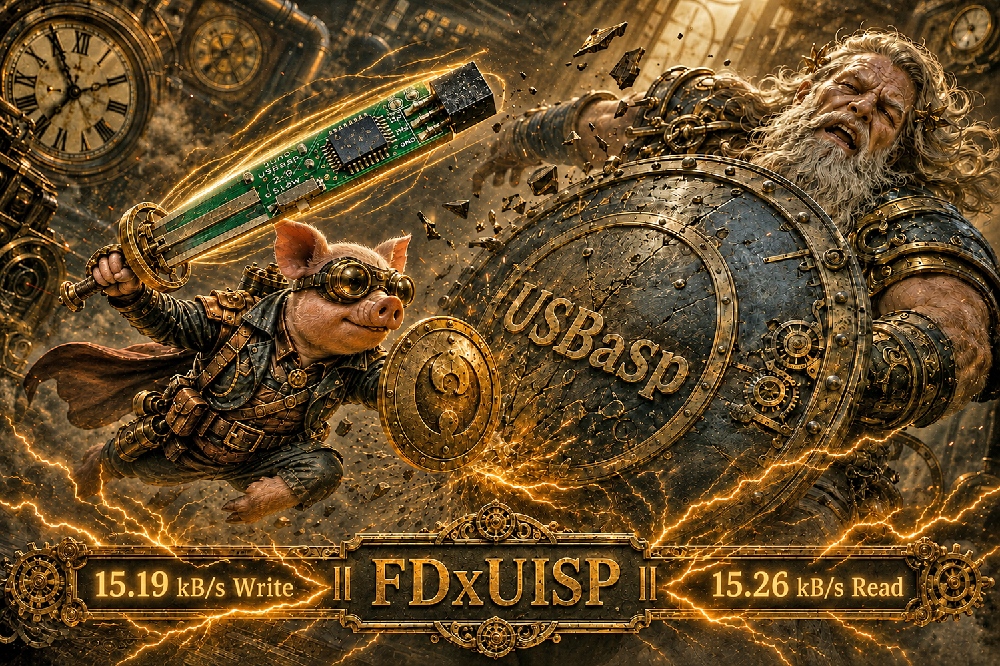
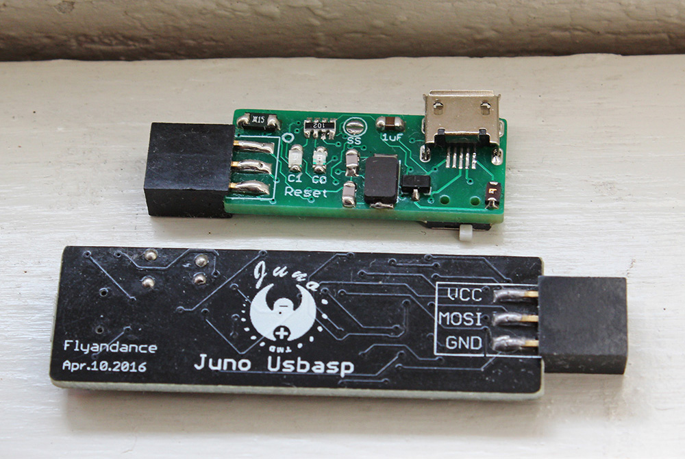
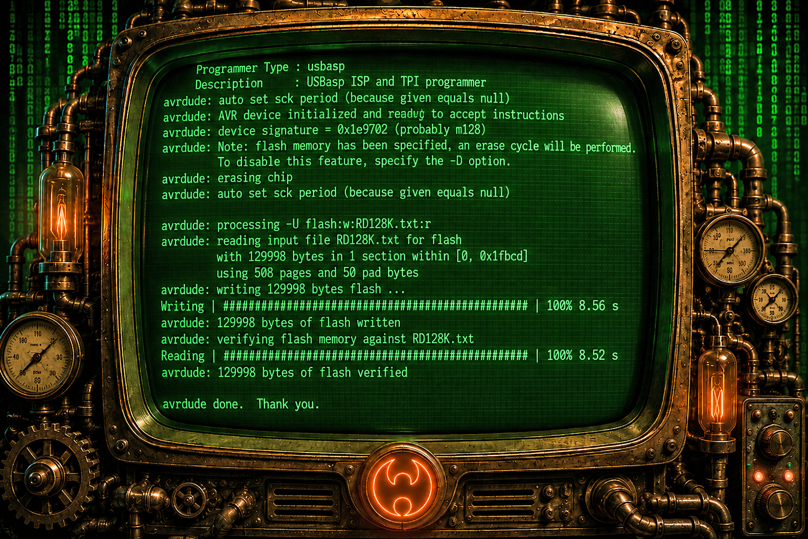

# FDxUISP - Ultimate USBasp Mod 15KB/s+

USBasp is a programmer based on the V-USB project, a virtual software-based USB device simulator. A programmer transfers compiled machine code into an MCU, so in that sense, a programmer is an uploader.

  

**Juno USBasp 2.0** is my second PCB design. It measures only **28 × 12 mm**, probably the world's smallest USBasp hardware. The firmware is christened **FDxUISP**. Everything, including V-USB, has been rewritten and optimized. FDxUISP V1.83 recorded **12.58 kB/s write** and **14.76 kB/s read** on ATmega16, and **15.19 kB/s write** and **15.26 kB/s read** on ATmega128.

## Why FDxUISP

The original firmware claims up to 5 KB/s. You are lucky to get half. It uses a fake AUTO SCK and normally selects a fixed speed of about 375 kHz.

A lot of what I learned while coding my AVR910 programmer was used to rewrite FDxUISP, including a real AUTO SCK algorithm. FDxUISP automatically scans from **4 MHz down to 488 Hz**, allowing fast programming while safely supporting heavily under-clocked MCUs.

The original hardware has a slow-clock switch. This is stupid and unnecessary when AUTO SCK is real. Since nearly every USBasp board has the switch, FDxUISP still uses it, but switching it turns on turbo mode to use the maximum SCK detected, which can sometimes be unstable because the SCK on the programmer needs to be slightly slower than the target SCK. This is actually very complicated in a real-world situation. If you use 12MHz in the programmer, you get a 3MHz maximum usable SCK. To program a 16MHz MCU, its maximum SCK is 4MHz, so the turbo mode works perfectly fine and stable in this situation, since 3MHz ≤ 4MHz. The list goes on and on. FDxUISP V1.83 has now reached **15.19 kB/s write** and **15.26 kB/s read** on the 129,998-byte ATmega128 test, with **12.58 kB/s write** and **14.76 kB/s read** on the 15,352-byte ATmega16 test.
 

## FDxUISP Features
- Transfer speed 15KB/s+ Tested on an Atmega128 with WinUSB driver
- Real and stable auto SCK that supports the fastest and slowest target CPU clocks
- Sophisticated timing management 
- Sophisticated LED code showing each stage of the programming process
- Rewritten TPI completely that achieves 0.35 kB/s Write and 3.92 kB/s Read on an Attiny10

## FDxUISP Speed

| Firmware | MCU | Test File | Write | Read |
|---|---|---:|---:|---:|
| Original USBasp | ATmega16 | 15,352 bytes | 2.39 kB/s | 3.87 kB/s |
| FDxUISP V1.83 | ATmega16 | 15,352 bytes | **12.58 kB/s** | **14.76 kB/s** |
| FDxUISP V1.83 | ATmega128 | 129,998 bytes | **15.19 kB/s** | **15.26 kB/s** |

  

## Programming Time Comparison

Estimated total time includes both flash writing and verification reading. The 32 KB estimate uses the FDxUISP V1.83 ATmega16 speed record; the 128 KB estimate uses the FDxUISP V1.83 ATmega128 speed record.

| MCU at 80% | Firmware | 1 | 10 | 100 | 1k | 10k |
|---|---|---:|---:|---:|---:|---:|
| 32 KB | **FDxUISP** | 4s | 39s | 6m 26s | 1h 4m | 10h 43m |
| 32 KB | Original | 18s | 2m 57s | 29m 34s | 4h 55m | 2d 1h |
| 128 KB | **FDxUISP** | 14s | 2m 18s | 22m 57s | 3h 49m | 1d 14h |
| 128 KB | Original | 1m 11s | 11m 50s | 1h 58m  | 19h 42m | 8d 5h |

## Buy Me a Coffee

