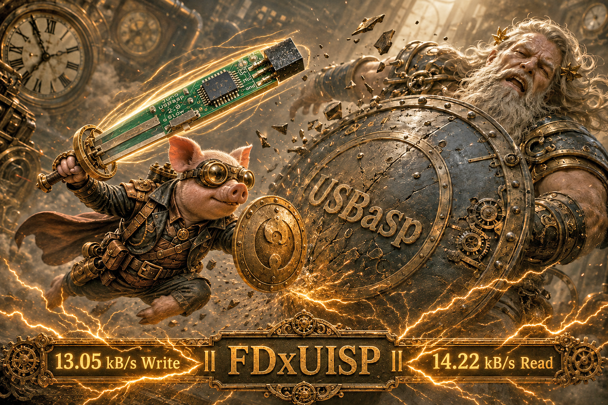
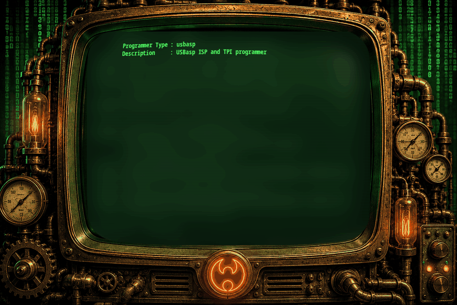

# FDxUISP - Ultimate USBasp Mod Programmer 10KB/s++

USBasp is a programmer based on the V-USB project, a virtual software-based USB device simulator. A programmer transfers compiled machine code into an MCU, so in that sense, a programmer is an uploader.

  

**Juno USBasp 2.0** is my second PCB design. It measures only **28 × 12 mm**, probably the world's smallest USBasp hardware. The firmware is christened **FDxUISP**. Everything, including V-USB, has been rewritten and optimized, with lightning-fast **13.05 kB/s write** and **14.22 kB/s read** speeds recorded.

## Why FDxUISP

The original firmware claims up to 5 KB/s. You are lucky to get half. It uses a fake AUTO SCK and normally selects a fixed speed of about **375 kHz**.

A lot of what I learned while coding my AVR910 programmer was used to rewrite FDxUISP, including a real AUTO SCK algorithm. FDxUISP automatically scans from **4 MHz down to 488 Hz**, allowing fast programming while safely supporting heavily under-clocked MCUs.

The original hardware has a slow-clock switch. This is stupid and unnecessary when AUTO SCK is real. Since nearly every USBasp board has the switch, FDxUISP still uses it, but switching it turns on super-speed mode. Technically, this can be simple and complicated, so no further explanation is provided.

## Firmware Speed

| Firmware | MCU | Test File | Write | Read |
|---|---|---:|---:|---:|
| Original USBasp | ATmega16 | 15,352 bytes | 2.39 kB/s | 3.87 kB/s |
| FDxUISP V1.7s | ATmega16 | 15,352 bytes | 10.59 kB/s | 13.01 kB/s |
| FDxUISP V1.7s | ATmega128 | 129,998 bytes | 12.52 kB/s | 13.28 kB/s |
| FDxUISP Highest Record | Recorded build | 129,998 bytes | **13.05 kB/s** | **14.22 kB/s** |

  

## Programming Time Comparison

Estimated total time includes both flash writing and verification reading. The 32 KB estimate uses the FDxUISP V1.7s ATmega16 speed record; the 128 KB estimate uses the ATmega128 speed record.

| MCU at 80% | Firmware | 1 | 10 | 100 | 1k | 10k |
|---|---|---:|---:|---:|---:|---:|
| 32 KB — 26,214 bytes | **FDxUISP** | 4s | 45s | 7m 29s | 1h 14m | 12h 28m |
| 32 KB — 26,214 bytes | Original | 18s | 2m 57s | 29m 34s | 4h 55m | 2d 1h 17m |
| 128 KB — 104,858 bytes | **FDxUISP** | 16s | 2m 43s | 27m 7s | 4h 31m | 1d 21h 11m |
| 128 KB — 104,858 bytes | Original | 1m 11s | 11m 50s | 1h 58m 17s | 19h 42m | 8d 5h 8m |

## Buy Me a Coffee

