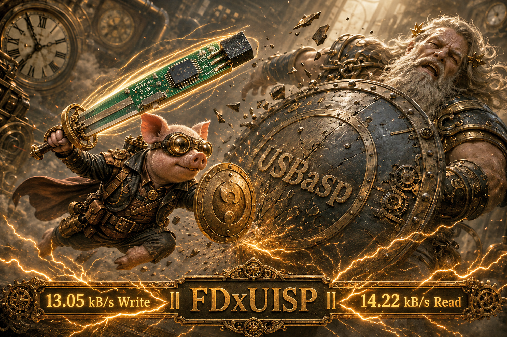
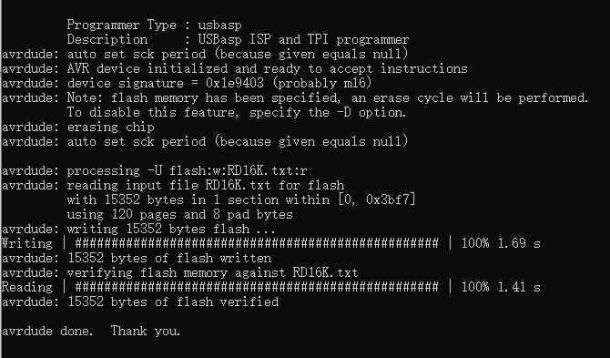

# FDxUISP

  

USBasp is a programmer based on the V-USB project, a virtual software-based USB device simulator. A programmer transfers compiled machine code into an MCU, so in that sense, a programmer is an uploader.

**Juno USBasp 2.0** is my second PCB design. It measures only **28 × 12 mm**, probably the world's smallest USBasp hardware. The firmware is christened **FDxUISP**. Everything, including V-USB, has been rewritten and optimized, with lightning-fast **13.05 kB/s write** and **14.22 kB/s read** speeds recorded.

## Why FDxUISP

The original firmware claims up to 5 KB/s. You are lucky to get half. It uses a fake AUTO SCK and normally selects a fixed speed of about **375 kHz**.

A lot of what I learned while coding my AVR910 programmer was used to rewrite FDxUISP, including a real AUTO SCK algorithm. FDxUISP automatically scans from **4 MHz down to 488 Hz**, allowing fast programming while safely supporting heavily under-clocked MCUs.

The original hardware has a slow-clock switch. This is stupid and unnecessary when AUTO SCK is real. Since nearly every USBasp board has the switch, FDxUISP still uses it, but switching it turns on super-speed mode. Technically, this can be simple and complicated, so no further explanation is provided.

## Juno USBasp 2.0 Hardware

- Compact V-USB programmer with an onboard AVR MCU and standard 6-pin ISP connector
- Firmware builds for supported MCUs and 12 MHz or 16 MHz clocks
- Selectable 5 V or 3 V target power
- SS self-programming pads for updating the onboard MCU
- PC2 speed switch: open selects normal AUTO SCK; grounded uses one physical SCK step slower

## Firmware Speed

  

| Firmware | Clock | Test File | Write | Read |
|---|---:|---:|---:|---:|
| Original USBasp | 12 MHz | 15,352 bytes | 2.39 kB/s | 3.87 kB/s |
| FDxUISP V1.7 | 12 MHz | 15,352 bytes | 10.37 kB/s | 13.01 kB/s |
| FDxUISP V1.7 | 16 MHz | 15,352 bytes | 12.48 kB/s | 14.62 kB/s |
| FDxUISP Highest Record | Recorded build | 129,998 bytes | **13.05 kB/s** | **14.22 kB/s** |

## Buy Me a Coffee

